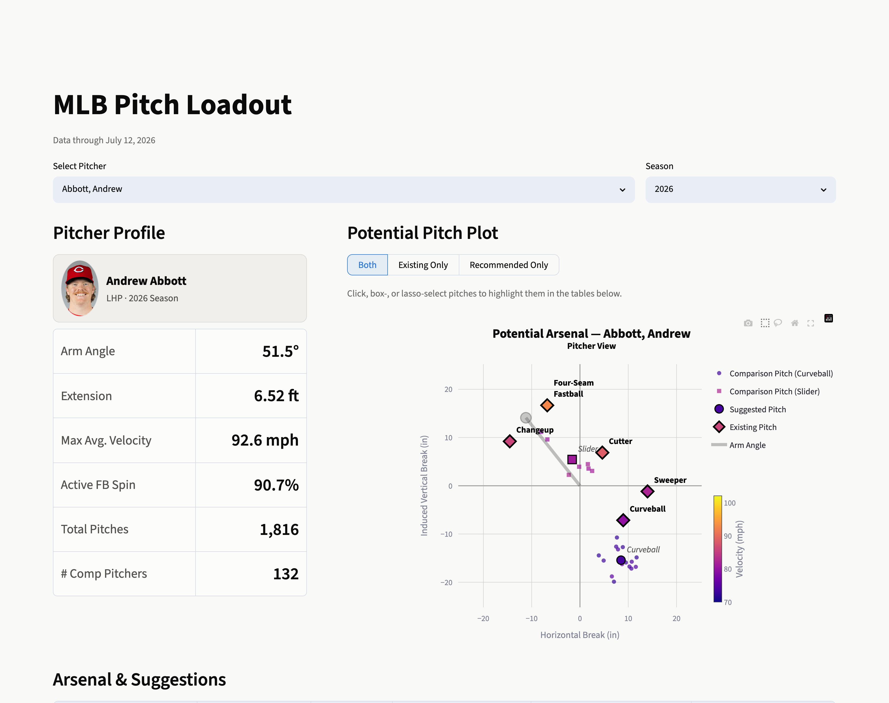

# MLB Pitch Loadout

**Try the app: [link coming soon — deploys via Streamlit Community Cloud]**

The goal of MLB Pitch Loadout is to provide MLB pitchers with reasonable suggestions for new pitches. The approach to this centers on identifying other pitchers with similar mechanics and selecting pitches they throw that our target pitcher does not. The theory is simple: two pitchers with a similar pitching process should have similar results, specifically, a similar arsenal.



## How it works

1. The user selects a target pitcher.
2. The app identifies a comparison group of biomechanically similar pitchers.
3. Pitches thrown by anyone in the comparison group that are distinct from every pitch in the target pitcher’s arsenal are isolated. These are called novel pitches.
4. K-Means clustering is run on the novel pitches to define pitch types. The best silhouette score between k=2 and k=4 defines the optimal k.
5. Outlier novel pitches are removed.
6. Steps 4 and 5 repeat until there are no more outliers.
7. The clusters of novel pitches are named for their most common pitch type, and the user sees this as suggested pitches for the pitcher

Data: 2021–2026 Statcast pitch data plus Baseball Savant's active-spin
leaderboards.

## Running locally

```bash
pip install -r requirements.txt
streamlit run app.py
```

The app reads only the prebuilt Parquet snapshots in `data/snapshots/`
(committed to the repo), so no raw data downloads are needed to run it.

## Repo layout

| Path | What it is |
|---|---|
| `app.py` | The Streamlit app (entrypoint) |
| `src/` | Code behind the app: similarity + suggestion pipeline (`pitch_suggestions.py`, `distances.py`) and the data build (`data.py`, `snapshot.py`) |
| `analysis/` | Research modules behind the methodology: feature evaluation (`biomech.py`), arsenal distance work (`arsenal.py`), year-over-year stability (`stability.py`), and holdout validation (`validation.py`) |
| `notebooks/` | The research notebooks — data exploration, similarity development, suggestion tuning, and 2026 validation |
| `data/snapshots/` | Aggregated Parquet tables the app reads (plus `meta.json` recording the data-through date) |
| `data/spin/` | Baseball Savant active-spin leaderboard exports (input to the snapshot build) |

## Methodology notes

The `analysis/` modules and `notebooks/` document how the tool's parameters were chosen — which biomechanical features carry signal, how the comp-distance and novelty thresholds were calibrated, and how suggestions were validated against pitchers who actually added a new pitch in 2026. Start with `notebooks/Data Exploration.ipynb` for the feature work and `notebooks/2026 Validation.ipynb` for the results.
